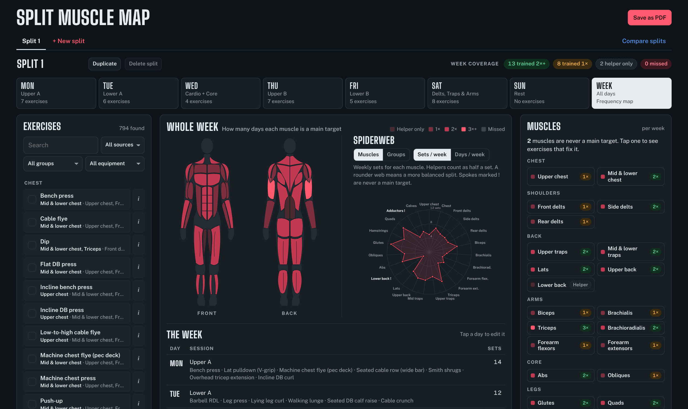
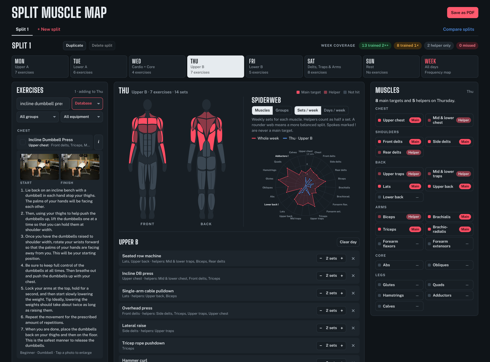
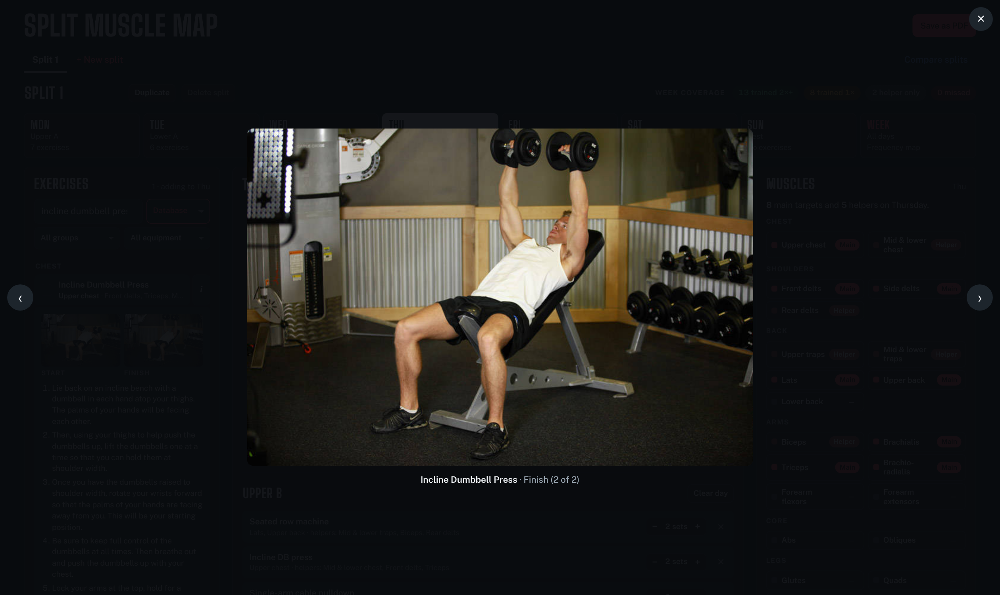
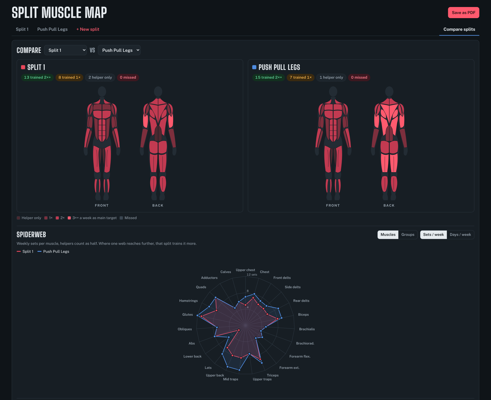

# Split Muscle Map

**Plan your weekly gym split and see exactly which muscles it trains.**

[](https://1mach0.github.io/split-muscle-map/)
[](LICENSE)


**[Open the app →](https://1mach0.github.io/split-muscle-map/)**



Pick exercises for each day and front and back body maps light up the muscles you're hitting. Switch to the week view to see how many days each muscle gets trained, check the balance on a spiderweb chart, and compare two splits side by side before you commit to one.

It's a single static page: no account, no server, no install. Your splits stay in your browser.

## Features

- **Body maps:** front and back views with 23 muscles. A day shows main targets and helpers. The week shows how often each muscle is a main target: 1×, 2×, 3×+, helper only or missed.
- **Spiderweb chart:** weekly sets or days per week, by muscle or by muscle group. Select a day to overlay it on the whole week.
- **794 exercises:** 75 hand-checked staples plus 719 from [Free Exercise DB](https://github.com/yuhonas/free-exercise-db), all with start and finish photos and step-by-step instructions. Tap a photo to see it full size.
- **Find the right exercise:** search by name or muscle, and narrow it down with the muscle group, equipment and source dropdowns. Tap a muscle on the map to list every exercise that trains it.
- **Multiple splits:** keep as many as you like in tabs. Duplicate one to try a variation.
- **Compare:** two splits side by side, with body maps, an overlaid spiderweb and a muscle-by-muscle table of days and sets.
- **PDF export:** body maps, spiderweb, every day with its own body maps and exercise table, and a full muscle coverage table. In compare view it exports the comparison.
- **Custom exercises:** add your own and tag the muscles they work.
- **Fits your screen:** on wide monitors the body map and spiderweb sit side by side, and the exercise and muscle panels stay in view while you scroll. On phones everything stacks.
- **Light and dark mode**, following your system setting.

## Screenshots

### Plan a day

Pick a day and tick exercises. Main targets light up bright, helpers dimmer, and the day is drawn in blue over the whole week on the spiderweb. Tap the **i** on any exercise for start and finish photos and instructions.



### See how it's done

Tap a photo to open it full size. Use the arrows, the arrow keys or a swipe to flip between the start and finish positions.



### Compare two splits

Put two splits side by side to see which one trains each muscle more often, with both drawn on one spiderweb.



## How the numbers work

Every exercise lists **main targets** (the muscles it's built for) and **helpers** (muscles that assist).

- **Days per week** counts only the days a muscle is a main target. Being a helper doesn't count as training it.
- **Sets per week** counts main-target sets in full and helper sets as half. This is a common rule of thumb, not an exact science.

A rounder spiderweb means a more balanced split. Spokes marked **!** are never a main target.

## Run it locally

```sh
git clone https://github.com/1mach0/split-muscle-map.git
cd split-muscle-map
open index.html          # macOS; or just double-click the file
```

If your browser is strict about local files, serve the folder instead:

```sh
python3 -m http.server 8000   # then visit http://localhost:8000
```

Fonts and the PDF library load from Google Fonts and jsDelivr, so the first visit needs an internet connection.

## Deploy your own copy

Fork the repo, then in your fork go to **Settings → Pages**, choose **Deploy from a branch**, pick `main` and `/ (root)`, and save. Your copy appears at `https://<your-username>.github.io/split-muscle-map/`.

## Project structure

```
index.html                  Page markup
css/styles.css              Styles and light/dark theme tokens
js/app.js                   App logic: state, body maps, spiderweb, compare, PDF export
js/data/exercise-db.js      Generated exercise database (don't edit by hand)
images/exercises/<id>/      Start and finish photos for database exercises
tools/build_exercise_db.py  Rebuilds the exercise database from Free Exercise DB
tools/fetch_images.py       Downloads and resizes the exercise photos
docs/                       README screenshots
```

Plain HTML, CSS and JavaScript, with no framework and no build step. The body maps and spiderweb are hand-built SVG. PDF export uses jsPDF.

## About the exercise data

The 75 staples were mapped to muscles by hand.

Free Exercise DB only uses about 17 broad labels ("shoulders", "chest", "middle back"). `tools/build_exercise_db.py` converts them to the map's 23 muscles using the exercise name, so "lateral raise" becomes side delts and "incline" becomes upper chest. Most come out right, but some won't.

If you spot a wrong one, please [open an issue](https://github.com/1mach0/split-muscle-map/issues) with the exercise name and the muscles it should show, or fix the rule in that script.

To refresh the data from the source:

```sh
python3 tools/build_exercise_db.py   # rewrites js/data/exercise-db.js
pip install pillow
python3 tools/fetch_images.py        # downloads any missing photos
```

## Roadmap

- [x] Photos and instructions for the staples, by linking them to their database match
- [ ] Weekly set targets per muscle, shown as a ring on the spiderweb
- [ ] Reps, RIR and notes per exercise
- [ ] Drag to reorder exercises and move them between days
- [ ] Warnings for overlap, such as heavy lower-back work on back-to-back days
- [ ] Split templates: push/pull/legs, upper/lower, full body, Arnold
- [ ] Share a split as a link; import and export as JSON
- [ ] An "equipment I have" profile that hides what your gym can't do
- [ ] Install as an offline app (PWA)
- [ ] A workout log to track weights over time
- [ ] More muscles on the map: neck, serratus, tibialis, hip flexors

Suggestions are welcome: [open an issue](https://github.com/1mach0/split-muscle-map/issues).

## Contributing

Bug reports, muscle-mapping fixes and feature ideas are all welcome. See [CONTRIBUTING.md](CONTRIBUTING.md).

## Credits

- Exercise data and photos: [Free Exercise DB](https://github.com/yuhonas/free-exercise-db) by yuhonas, released into the public domain (Unlicense).
- PDF export: [jsPDF](https://github.com/parallax/jsPDF) and [jsPDF-AutoTable](https://github.com/simonbengtsson/jsPDF-AutoTable) (MIT).
- Fonts: [Big Shoulders Display](https://fonts.google.com/specimen/Big+Shoulders+Display) and [Public Sans](https://fonts.google.com/specimen/Public+Sans) (SIL Open Font License).

## Disclaimer

Split Muscle Map is a planning tool, not medical or coaching advice. Muscle involvement is simplified and varies with technique and anatomy. If you have an injury or health condition, check with a qualified professional before changing your training.

## License

The code is released under the [MIT License](LICENSE). The exercise data and photos come from Free Exercise DB and are in the public domain.
