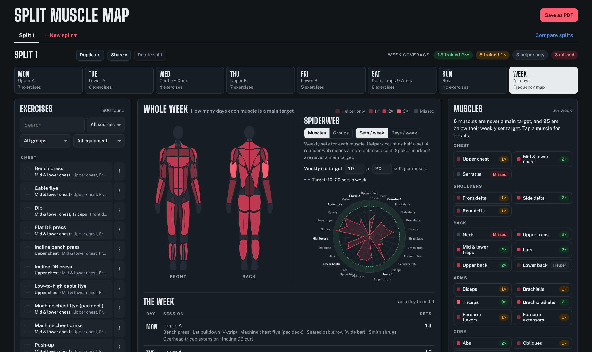
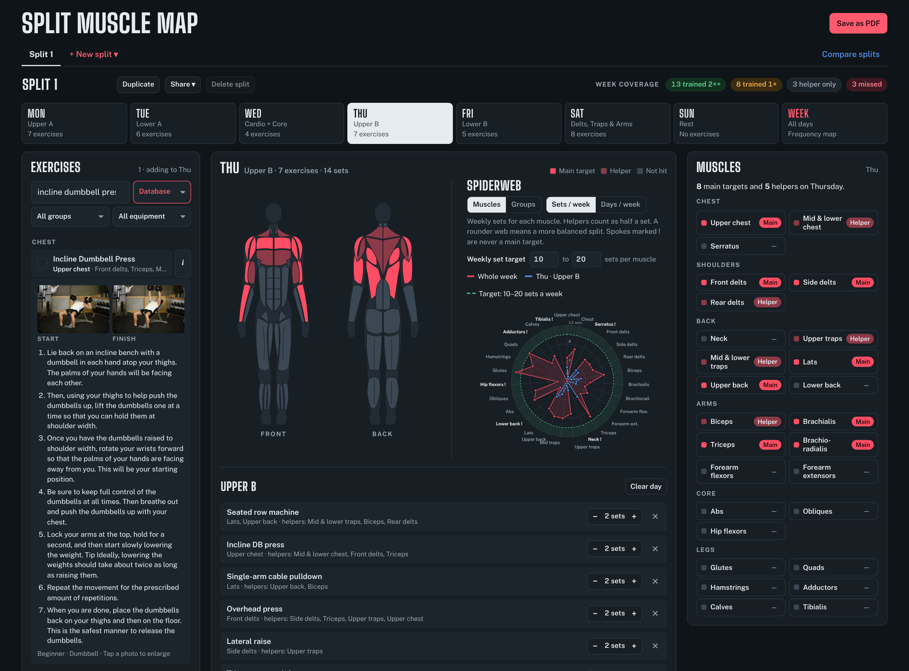
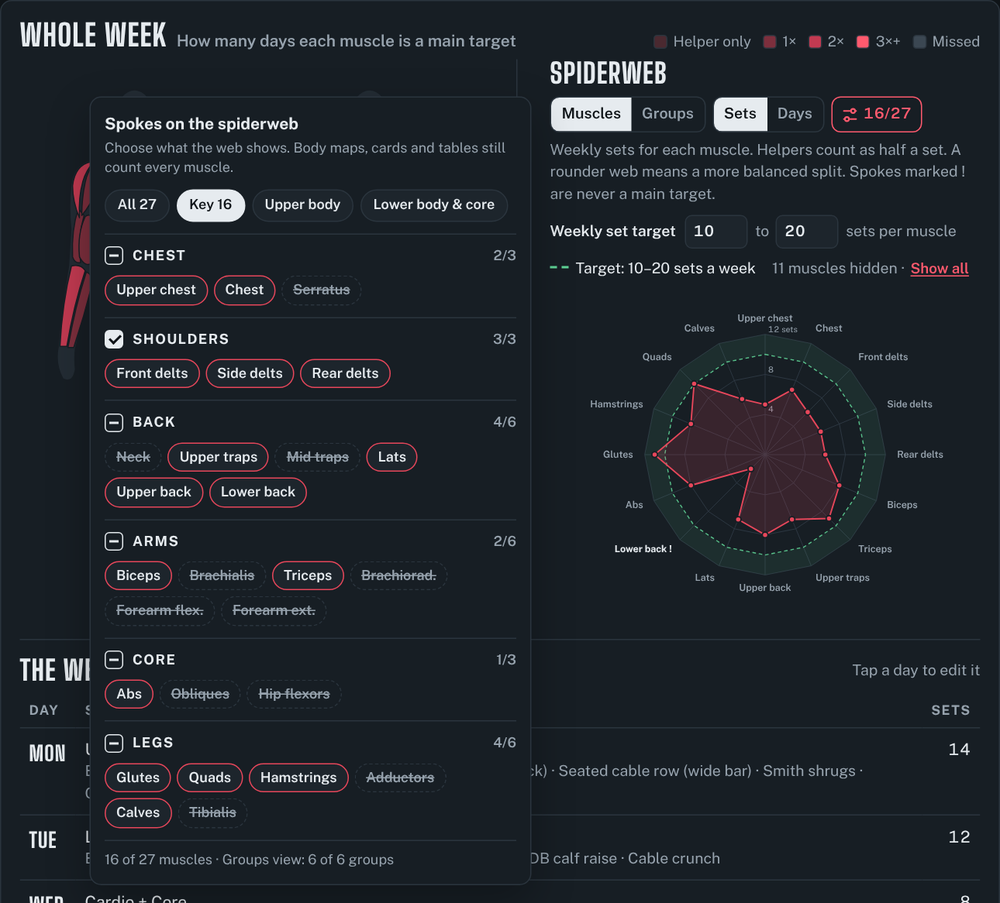
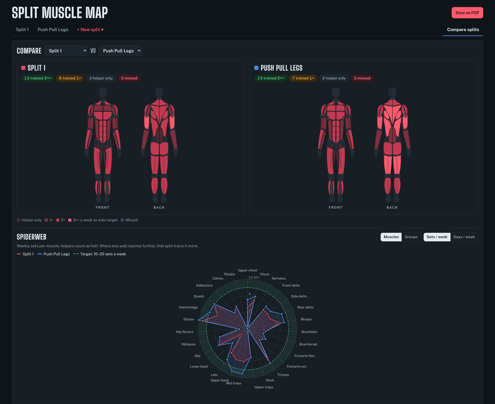

# Split Muscle Map

Plan your weekly gym split and see which muscles it trains.

**[Open the app →](https://1mach0.github.io/split-muscle-map/)**



## Features

- Front and back body maps with 27 muscles
- Spiderweb chart of weekly sets or days per muscle, with set targets
- 806 exercises with photos and instructions
- Templates: Push / Pull / Legs, Upper / Lower, Full body, Arnold
- Compare two splits side by side
- Share as a link, export to JSON or PDF
- Custom exercises, light and dark mode

## Screenshots

| Plan your split | Spiderweb view of split |
|---|---|
|  |  |

| Exercise photos | Compare splits |
|---|---|
|  |  |

## Run locally

```sh
git clone https://github.com/1mach0/split-muscle-map.git
cd split-muscle-map
python3 -m http.server 8000
```

## Roadmap

- [x] Photos and instructions for the staples, by linking them to their database match
- [x] Weekly set targets per muscle, shown as a ring on the spiderweb
- [ ] Reps, RIR and notes per exercise
- [ ] Drag to reorder exercises and move them between days
- [ ] Warnings for overlap, such as heavy lower-back work on back-to-back days
- [x] Split templates: push/pull/legs, upper/lower, full body, Arnold
- [x] Share a split as a link; import and export as JSON
- [ ] An "equipment I have" profile that hides what your gym can't do
- [ ] Install as an offline app (PWA)
- [ ] A workout log to track weights over time
- [x] More muscles on the map: neck, serratus, tibialis, hip flexors
- [x] Choose which muscles and groups the spiderweb shows

Suggestions are welcome: [open an issue](https://github.com/1mach0/split-muscle-map/issues).

## Contributing

Bug reports, muscle-mapping fixes and feature ideas are all welcome. See [CONTRIBUTING.md](CONTRIBUTING.md).

## Credits

- Exercise data and photos: [Free Exercise DB](https://github.com/yuhonas/free-exercise-db) (public domain)
- PDF export: [jsPDF](https://github.com/parallax/jsPDF)

## License

[MIT](LICENSE).
